# Alex Tong 👋

Principal Investigator at [Aithyra](https://www.oeaw.ac.at/aithyra) in Vienna, working on generative models for proteins and cells.

---

### About

I'm a PI at [Aithyra](https://www.oeaw.ac.at/aithyra) (a research institute at the intersection of ML and life sciences in Vienna, led by Michael Bronstein), where I build generative models for proteins and cells. My research focuses on:

- **Flow matching** — simulation-free training of continuous normalizing flows
- **Protein design** — generative models over SE(3) and sequence spaces
- **Boltzmann sampling** — scalable methods for sampling from molecular distributions
- **Single-cell dynamics** — modeling cellular trajectories and causal discovery

Before Aithyra, I was briefly an assistant professor at Duke, a postdoc with [Yoshua Bengio](https://yoshuabengio.org) at Mila, and I completed my PhD at Yale advised by [Smita Krishnaswamy](https://www.krishnaswamylab.org). I also cofounded [Dreamfold](https://www.dreamfold.ai/).

---

### Featured Projects

| Project | Description | Stars |
|---------|-------------|-------|
| [TorchCFM](https://github.com/atong01/conditional-flow-matching) | Conditional Flow Matching library for training flow models |  |
| [Open-dLLM](https://github.com/pengzhangzhi/Open-dLLM) | Open diffusion language model for code generation |  |
| [FoldFlow](https://github.com/DreamFold/FoldFlow) | SE(3)-stochastic flow matching for protein backbone generation |  |
| [DISCO](https://github.com/DISCO-design/DISCO) | General multimodal protein design with DNA-encoded chemistry |  |
| [transferable-samplers](https://github.com/transferable-samplers/transferable-samplers) | Amortized sampling of molecular systems with normalizing flows |  |

---

### GitHub Stats

---

📚 Check out my [publications](https://alextong.net/#publications) — including work on [FALCON](https://arxiv.org/abs/2512.09914), [PAPL](https://arxiv.org/abs/2509.23405), and [PITA](https://arxiv.org/abs/2506.16471).

🇦🇹 Based in Vienna, Austria · 🇺🇸 Grew up in Seattle

